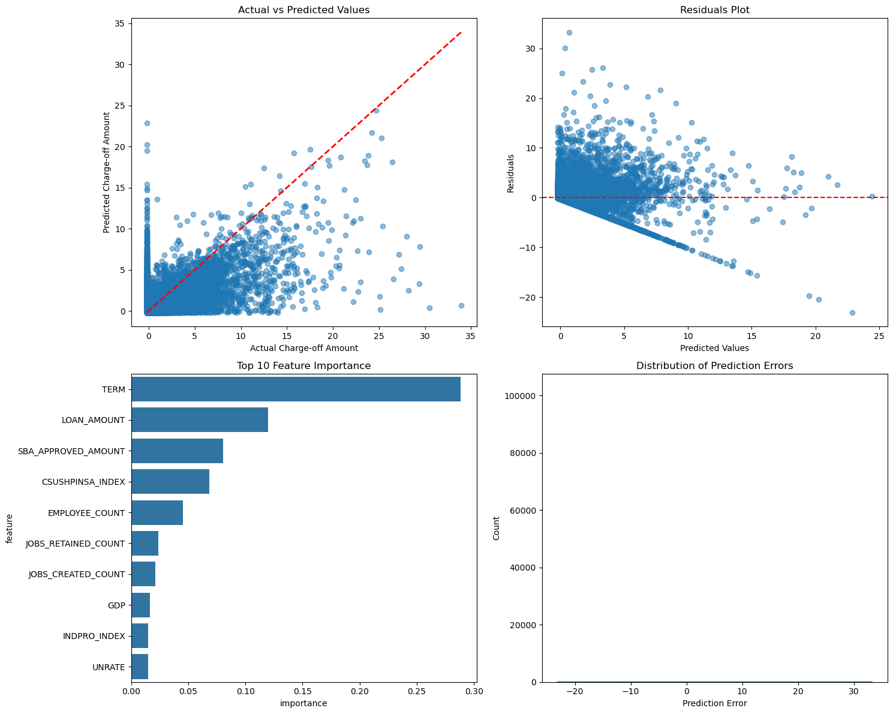

# Loan Charge-Off Analysis

This repository contains code and visualizations related to the analysis of loan charge-offs across industries, using macroeconomic indicators and machine learning models for prediction. I did this as part of an interview for the Wharton Analytics Fellows. 

## Table of Contents

- [Overview](#overview)
- [Project Structure](#project-structure)
- [Data Sources](#data-sources)
- [Results](#results)

---

## Overview

This project analyzes loan charge-offs using a combination of economic indicators, machine learning models, and statistical techniques. The goal is to understand factors influencing loan defaults and predict charge-off amounts effectively.

Key components include:
- Data retrieval from **FRED API** for macroeconomic indicators.
- Visualization of charge-off distributions across industries.
- Machine learning classification and regression models for charge-off predictions.

---

## Project Structure

```
.
├── fetch_macro_data.py          # Fetches macroeconomic data from FRED API
├── generate_figures.ipynb       # Notebook for generating visualizations
├── main_analysis.ipynb          # Main analysis notebook (classification & regression)
├── images/                      # Directory containing visualizations
│   ├── chgoff_by_industry.png
│   ├── classification_metrics.png
│   ├── loan_vs_chgoff.png
│   ├── regression_metrics.png
│   ├── short_term_vs_long_term.png
│   ├── ...
└── README.md                    # Project documentation
```

---


## Data Sources

- **Federal Reserve Economic Data (FRED API)** for macroeconomic indicators.
- **Loan Charge-off Dataset** Provided by Wharton Analytics Fellows.
- **Scikit-learn Models** for classification and regression analysis.

---

## Results

### Charge-off Distribution by Industry


### Loan Amount vs. Charge-off Amount


### Classification Model Performance


Classification model achieved an accuracy of 93.5% with an AUC of 0.96. 

### Regression Model Performance


### Short vs. Long-Term Loan Charge-offs


More detailed results and insights can be found in the Jupyter notebooks.

